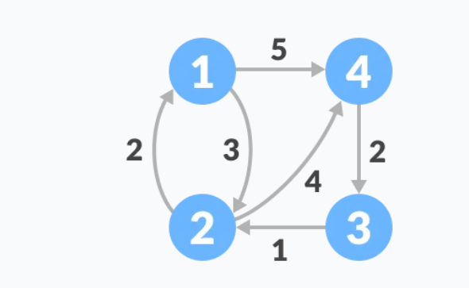
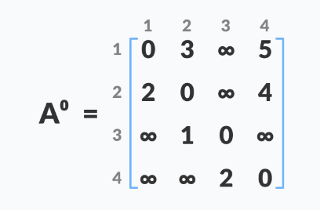

## Graph

### Floyd Warshall
Floyd-Warshall Algorithm is an algorithm for finding the shortest path between all the pairs of vertices in a weighted graph. This algorithm works for both the directed and undirected weighted graphs. But, it does not work for the graphs with negative cycles (where the sum of the edges in a cycle is negative).  

  

* **Steps for calculating the minimum distance for all vertexs**
1. Initialize the solution matrix same as the input graph matrix as a first step.
2. Then update the solution matrix by considering all vertices as an intermediate vertex.
3. The idea is to one by one pick all vertices and updates all shortest paths which include the picked vertex as an intermediate vertex in the shortest path.
4. When we pick vertex number k as an intermediate vertex, we already have considered vertices {0, 1, 2, .. k-1} as intermediate vertices.
5. For every pair (i, j) of the source and destination vertices respectively, there are two possible cases.  

        1. k is not an intermediate vertex in shortest path from i to j. We keep the value of dist[i][j] as it is.
        2. k is an intermediate vertex in shortest path from i to j. We update the value of dist[i][j] as dist[i][k] + dist[k][j] if dist[i][j] > dist[i][k] + dist[k][j]


   

```java
class Floyd_Warshall{
    int[][] floydWarshall(int graph[][]) {
        int dist[][] = new int[V][V];
        int i, j, k;
 
        /* Initialize the solution matrix same as input graph matrix.
           Or we can say the initial value of shortest distances
           are based on shortest paths considering no intermediate vertex. */
        for (i = 0; i < V; i++)
            for (j = 0; j < V; j++)
                dist[i][j] = graph[i][j];
 
        /* Add all vertices one by one
           to the set of intermediate
           vertices.
          ---> Before start of an iteration,
               we have shortest
               distances between all pairs
               of vertices such that
               the shortest distances consider
               only the vertices in
               set {0, 1, 2, .. k-1} as
               intermediate vertices.
          ----> After the end of an iteration,
                vertex no. k is added
                to the set of intermediate
                vertices and the set
                becomes {0, 1, 2, .. k} */
        for (k = 0; k < V; k++) {
            // Pick all vertices as source one by one
            for (i = 0; i < V; i++) {
                // Pick all vertices as destination for the
                // above picked source
                for (j = 0; j < V; j++) {
                    // If vertex k is on the shortest path
                    // from i to j, then update the value of
                    // dist[i][j]
                    if (dist[i][k] + dist[k][j]
                            < dist[i][j])
                        dist[i][j]
                                = dist[i][k] + dist[k][j];
                }
            }
        }
        return dist;
    }
}
```
